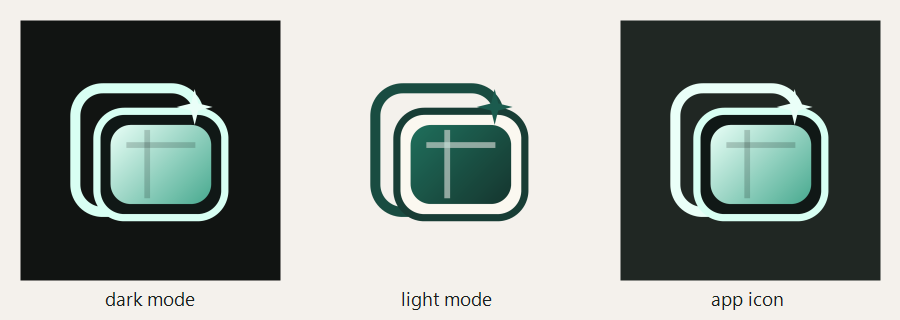

# Mado Icon

Mado のアイコンは、テキストなしの「小さな窓」をモチーフにしたマークです。

## Files

| File | Purpose |
| --- | --- |
| `assets/icons/mado-dark.svg` | ダークモード背景向けの SVG |
| `assets/icons/mado-dark.png` | ダークモード背景向けの PNG |
| `assets/icons/mado-light.svg` | ライトモード背景向けの SVG |
| `assets/icons/mado-light.png` | ライトモード背景向けの PNG |
| `assets/icons/mado-app.svg` | アプリ本体アイコンの SVG |
| `assets/icons/mado-app.png` | アプリ本体アイコンの PNG |
| `assets/icons/mado.ico` | Tauri / Windows 用の ICO |

## Preview

